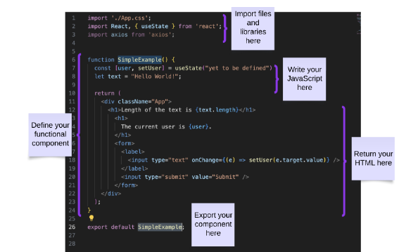
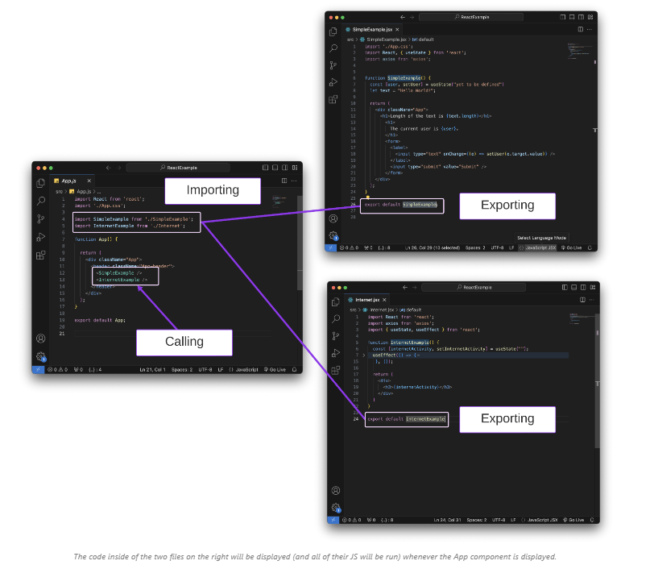
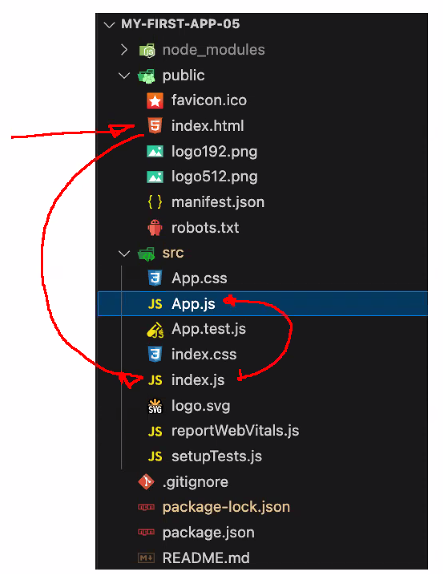
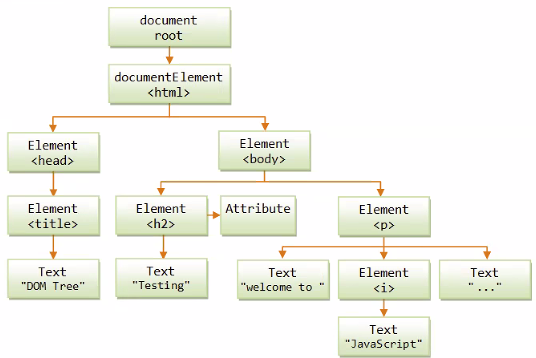

# Frontend

## React





### DOM



### Hooks
- hooks help functional components manage state

- useEffect for side effects

``` javascript
useEffect(() => {

},[]) // wiill run only once if empty array, if nothing is there will rerender multiple times
```

- useState update state. Imagine you want to update the count, you would use setCount. The title change would be a useEffect side effect
- useMemo caches expensive processes on rerender reloads
- useRef allows us to have a default value for more efficient handling of rerenders

### Callbacks
- callbacks are funcitons inside of functions, this means they must wait till the original function runs and then