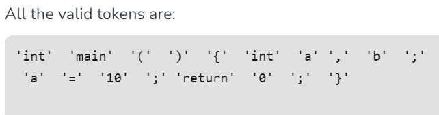
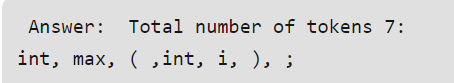

# Lexical Analyzer for Java Compiler


- This is my project scope document that includes Features and Libraries that I'm using. It also includes a general gameplan for how I am going to build the Lexical Analyer
- I will focus on coding the Lexical Analysis for my project and everything else would be importing libraries. 


However for lets look at the total phases
1) Lexical Analysis String -> Token
2) Syntactic Analysis (Parsing) -> Token -> AST
3) Semantic Analysis [Validating AST]
4) Optimization (Optional)
5) Code Generation [AST -> Java Bytecode]

## GamePlan
- I want to build the Lexical Analyzer part and find custom librariers for the other 3-4 parts
- I might not get to using the Custom libraries but if I do  They are listed below:

### The Libraries to use
2) Syntactic Analysis (Parsing) -> Token -> AST 
- **ANTLR**
<https://www.antlr.org/>

3) Semantic Analysis [Validating AST] 
- **Java Symbol Solver**
<https://javaparser.org/>

4) Optimization (Optional)
5) Code Generation [AST -> Java Bytecode]
- ** JavaPoet ** (May Change Later)
<https://github.com/square/javapoet>

## Lexical Analysis Notes
- first phase of compiler known as  a Scanner, it converts High level imput program into a sequence of tokens
- <https://www.geeksforgeeks.org/introduction-of-lexical-analysis/>
- Lexical analysis can be implemented with a Deterministic finite Automata (which is a set of defined rules to solve a problem) and the output is a sequence of tokens that is sent to the parser for syntax analysis

- lol I found a library that does all of the regex and patterns for me https://docs.oracle.com/javase/8/docs/api/java/util/regex/Pattern.html
    - I may do this myself or just import from the libary we will see what time permits


### Token
- sequence of characters treated as a unit in the grammar of programming languages. Examples
- Types (id, number) Punctuation (IF, void, return) Alphabetic (keywords, for, while)


- Non Tokens would be something like comments, blank lines
- **Lexeme** would be characters matched by a pattern that comprises a single token

### Methodology
- Input Preprocessing -> Tokenization -> Token Classification -> Token Validation -> Output Generation
- Input Preprocessing removes non-essential characters like comments
- Tokenization udpates input text into tokens using regEx
- Token classification - Token type is decided(keywords, identifiers, operators, punctuation symbols etc)
- Token validation - checks valid syntax or variable names or valid
- Output Generation - Generates list of tokens that can be passed to the next stage typically compilation or intepretation

**Example**
```java
int main()
{
  // 2 variables
  Example1
  int a, b;
  a = 10;
 return 0;
}
Notice how comments are omitted

Example 2
int max(int i);
```




**Advantages of Lexical Analysis**
- Simplifies Parsing, Error Detection, Effiency
**Disadvantages of Lexical Analysis**
- Limited Context, only accesses tokens individually doesn't consider total code
- Overhead, Debugging Challenges

## Features And Rulest a
**MVP**
- Lexical Analyzer will use enum types to identify each character within a user's code file. There will be a UI option that then allows the user to see which of their characters are which token type
- UI: A user will select there file with a simple GUI, once file has been loaded in They will have a list of options
- UI: Allows run and compile of the compiler
- UI: Gives the user a list of all the possible tokenTypes and examples of them. for example each item in the list below will be able to print out there own list. I will probably use a HashMap as well as an arraylist so that a user can select the identifier and a list of examples will come out. I may just use a giant string as well if that looks better:
-   IDENTIFIER, KEYWORD, NUMBER, STRING, OPERATOR, SEPERATOR, COMMENT, WHITESPACE, ERROR;
- UI: while waiting for user input a thread will be used to execute the Lexical Analyzer
- Error detection: By having robust error handling, 
- GUI: javafx For file input. The rest of code will be outputted in the console https://openjfx.io/javadoc/22/

**Possible Product**
- Token Caching: for tokens that are frequently seen, I could create caching (maybe using a HashMap?) that would return this more efficiently. Although I do believe I would need some sort of databse to do this ()
- UI: Allows step by step execution of the each part of the compiler
- UI: while waiting for user input a thread will be used to execute the Lexical Analyzer. This will execute the rest of the compiler as well
- GUI: javafx for all input and outputs

### Resources that could be helpful
- **Visitor Pattern** : A design pattern that allows adding further operations to objects without modifying them. It uses the double-dispatch mechanism to execute operations on different types of objects.
- **Java ASM**: A powerful library for manipulating Java bytecode. It allows developers to read, modify, and write bytecode programmatically, enabling dynamic class transformations and instrumentation.

```
<https://docs.oracle.com/javase/8/docs/api/javax/tools/package-summary.html>
<https://www.jflex.de/>
Project to base it off of
<https://medium.com/javarevisited/build-a-tiny-compiler-in-java-662f67a1ce85#:~:text=Build%20a%20Tiny%20Compiler%20in%20Java%201%201.,ASM%29%20...%206%206.%20Chaining%20and%20compiling.%20>
```

### Feedback
- put the most important rules in the document
    **The most import part are in the rules**

    
- would be reading from a file
- I can do a console projet
- specifiy the output, is it in the console or another file 