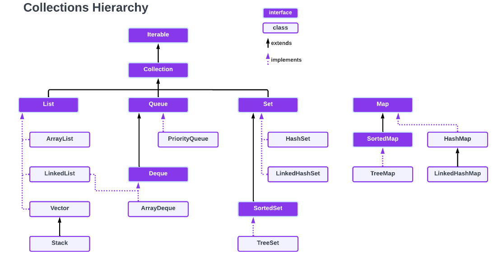
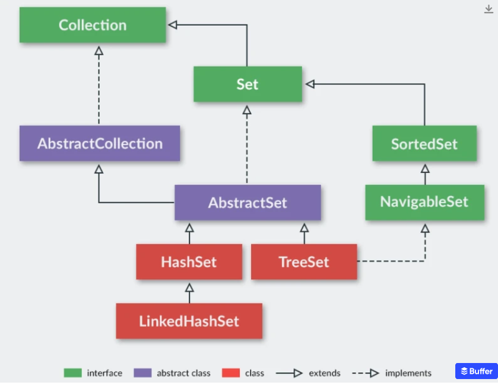

# Collections

 - Interfaces can't directly be used to initiate objects, instaed we extend the ArrayList
 - This means in practice that people generally use ArrayList for data storage, but they use LinkedList for data manipulation. We'll talk more about LinkedLists in the lessons that follow.
 -ArrayList are used for data storage while LinkedList for data manupulation
 ```java
List<T> variableName = new ArrayList<T>();
ArralyList<T> variableName = new ArrayList<>();
list4.forEach(tempVariable -> System.out.println(tempVariable));
persons.forEach(System.out::println);

 


Question
What is the difference between the two above?
 ```
A data structure is data organized in a  particular way plus a set operations to perform thse data. Operations such as read, insert, update, delete, sort 

**OVERRIDING THE EQUALS METHOD IS REALLY IMPORTANT **

A lot of times you want to compare objects especially using anonymous functions.
```java
		 * 4. Iterator
		 */
		/*
		 * Iterators are useful when you want to remove elements from the ArrayList
		 * while traversing it. If you try to remove elements from the ArrayList using:
		 * traditional for-loop, for-each loop, forEach() method, you will get a
		 * ConcurrentModificationException.
		 */
		ListIterator<String> ite = list4.listIterator(); // Create an iterator
		
		while ( ite.hasNext() ) { // Ask if the list has more elements 
			System.out.println(ite.next()); // jump to the next element
			ite.remove();
		}

		System.out.println(list4);
		/*
	    for (String str : list4) {
			list4.remove(str);
		}*/
	}
 ```

 ## LinkedList


ArrayLists
- backed by arrays
- better than linked only if we don't need to do insertions

- LinkedList are slow for iterations
- Perform better than ArrayList if we need to insert or remove elements from a huge list frequently

## Set

-Hash means that the class implements the hash algorithm which is an algorithm for searching
HashSet
- Sets don't keep insertion order and Don't accept duplicates
- TreeSet and LinkedSet keep insertion order

```java
Set<String> set2 = Set.of("John", "John", "John", "John", "John", "mark");

```
LinkedHashSet
- keeps insertion order

TreeSet
- Sorts the elements

What's cool about any interface / class that extends the collection interface is you get access to all the base abstract methods that you are familiar with 