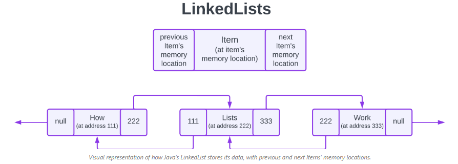

# Collections

 - Interfaces can't directly be used to initiate objects, instaed we extend the ArrayList
 - This means in practice that people generally use ArrayList for data storage, but they use LinkedList for data manipulation. We'll talk more about LinkedLists in the lessons that follow.
 -ArrayList are used for data storage while LinkedList for data manupulation
 ```java
List<T> variableName = new ArrayList<T>();
ArralyList<T> variableName = new ArrayList<>();
list4.forEach(tempVariable -> System.out.println(tempVariable));
persons.forEach(System.out::println);

 


Question
What is the difference between the two above?
 ```
A data structure is data organized in a  particular way plus a set operations to perform thse data. Operations such as read, insert, update, delete, sort 

**OVERRIDING THE EQUALS METHOD IS REALLY IMPORTANT **

A lot of times you want to compare objects especially using anonymous functions.
```java
		 * 4. Iterator
		 */
		/*
		 * Iterators are useful when you want to remove elements from the ArrayList
		 * while traversing it. If you try to remove elements from the ArrayList using:
		 * traditional for-loop, for-each loop, forEach() method, you will get a
		 * ConcurrentModificationException.
		 */
		ListIterator<String> ite = list4.listIterator(); // Create an iterator
		
		while ( ite.hasNext() ) { // Ask if the list has more elements 
			System.out.println(ite.next()); // jump to the next element
			ite.remove();
		}

		System.out.println(list4);
		/*
	    for (String str : list4) {
			list4.remove(str);
		}*/
	}
 ```

 ## LinkedList


ArrayLists
- backed by arrays
- better than linked only if we don't need to do insertions

- LinkedList are slow for iterations
- Perform better than ArrayList if we need to insert or remove elements from a huge list frequently

## Set

-Hash means that the class implements the hash algorithm which is an algorithm for searching
HashSet
- Sets don't keep insertion order and Don't accept duplicates
- TreeSet and LinkedSet keep insertion order

```java
Set<String> set2 = Set.of("John", "John", "John", "John", "John", "mark");

static void check(Set<String> set1, Set<String> set2) {
	for (String str: set1) {
		if (set2.contains(str))
	}
}
// notice how if we don't use the parameratized type Set<String> then we will get an error for String str

```
LinkedHashSet
- keeps insertion order
-Internally uses HashSet and LinkedList

TreeSet
- Sorts the elements

What's cool about any interface / class that extends the collection interface is you get access to all the base abstract methods that you are familiar with 
- We don't have get we have contains() method in sets. This checks if the element is contained in the set. this makes sense as there's no order in the set.

## HashAlgorithm
- even potent function that returns the same function returns the same value for the same paratmeters

## Map

initialCapacity - the initial capacity. This allows us to specify how big we want the LinkedHashMap to be when it is first created, essentially reserving space in memory for the items we want to put in it.

loadFactor - the load factor. When the initial capacity is getting close to being full, Java will automatically expand the capacity of the map. The load factor determines what percentage of our capacity will be expanded to reserve space for more elements to be inserted.

accessOrder - the ordering mode. This is a boolean value that we set to true for access order or false for insertion order

keySet() method is used to access the keys in the LinkedHashMap

values() method is used to access the values in the LinkedHashMap 

entrySet() method is used to access the key-value pairs in the LinkedHashMap.

## Multithreading

 if you extend the Thread class, you have to override the run method in order to make it work, whereas, if you implement the Runnable interface, you have to implement the run method. The Runnable interface will also require that you instantiate a variable as in Thread myThread = new Thread(nameOfClassThatExtendsRunnable); and then call the start() method on that myThread instance you just made.I 
 - the start() method calls run() method. First it performs system-level preprations and then invokes run. The start method method creates a new thread of execution. It interacts with the operating system to create a new thread. Once the thread is created it calls run. 
 - the run method runs on a new thread, not on the main thread. Any method with run will execute concurrently with the main program

```
Main Method
    |
    +--> Method A
    |       |
    |       +--> Method B
    |               |
    |               +--> Method C
    |
    |-- Method C completes, stack frame removed
    |
    |-- Method B completes, stack frame removed
    |
    |-- Method A completes, stack frame removed


Thread 1 (T1)            Thread 2 (T2)
    |                        |
    +--> Method X            +--> Method Y
    |       |                |       |
    |       +--> Method Z    |       +--> Method W
    |
    |-- Method Z completes   |-- Method W completes
    |
    |-- Thread T1 completes  |-- Thread T2 completes, resources reclaimed

```
