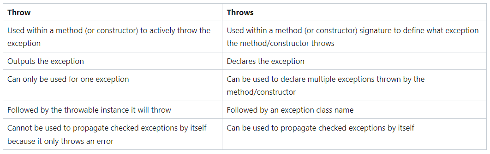

# 4 Best Practices for Custom Exceptions in Wedding Planning

Imagine planning a wedding where the seating arrangement is crucial. Implementing custom exceptions in your code is similar to ensuring everyone is seated harmoniously. Here are four best practices to keep in mind:

## 1. Always Provide a Benefit

Think of a custom exception as making sure two people who don't get along are not seated at the same table. For example, a `ConflictGuestsException` ensures that Alice and Bob, who have a history, aren't placed together.

```java
public class ConflictGuestsException extends Exception {
    public ConflictGuestsException(String message) {
        super(message);
    }
}
```

---
## 2. Follow the Naming Convention

Just like wedding invitations should be clear, your custom exceptions should end with “Exception” to be immediately recognizable. It’s a small detail that makes a big difference in understanding.

--- 
## 3. Provide Javadoc Comments for Your Exception Class

Documenting your exceptions is like giving clear seating instructions to the wedding planner. It helps everyone understand why certain decisions are made.

```java
/**
 * The ConflictGuestsException is thrown when two conflicting guests are seated together.
 * This helps maintain harmony at the event.
 * 
 * @param message Description of the conflict
 */
public class ConflictGuestsException extends Exception {
    public ConflictGuestsException(String message) {
        super(message);
    }
}
```

---
4. Provide a Constructor That Sets the Cause

When a general exception occurs, like exceeding the table limit, you should provide details. For example, if more than 8 people are added to a table, an OutOfBoundsException should explain why.

```java


public void addGuestToTable(List<String> guests, String newGuest) throws OutOfBoundsException {
    try {
        if (guests.size() >= 8) {
            throw new ArrayIndexOutOfBoundsException("Table cannot have more than 8 guests.");
        }
        guests.add(newGuest);
    } catch (ArrayIndexOutOfBoundsException e) {
        throw new OutOfBoundsException("Exceeded table capacity.", e);
    }
}
```

---
## Bonus: Another Specific Custom Exception

Imagine you have a custom exception to handle dietary restrictions. If you seat a vegan guest at a table full of meat dishes, it throws a DietaryRestrictionException.

```java

public class DietaryRestrictionException extends Exception {
    public DietaryRestrictionException(String message) {
        super(message);
    }
}
```

By following these best practices, your wedding planning (and coding) will be smooth and error-free, ensuring a perfect celebration!

## Other important facts
- Exceptoins only happen at runtime
- Exceptions are an abnormal situation during the execution of a program
calls the constructor of the parent Exception class, passing the message to it.
### Throwable
- Superclass of exceptions,all errors and exceptions are subclasses of exceptions

throws Clause: Declares that addGuestToTable can throw specific exceptions.
throw Statements: Actually throw exceptions when certain conditions are met.
Handling Exceptions: The main method catches and handles these exceptions.



```java


- throw creates a new throwable object?
- this stops execution and send the control flow to the nearest catch block
if (guest.equals(conflictingGuest)) {
    throw new ConflictGuestsException("Cannot sit our " + newGuest + " with " + conflictingGuest);
}

In Java, exception handling means taking care of runtime errors, so that the regular flow of the application can be preserved. Java Exception Handling is a mechanism to handle runtime errors such as ClassNotFoundException and IOException, which refer to missing classes and bad input/output respectively.

As we've seen, an exception is an unwanted or unexpected event which occurs during the execution of a program (i.e. at runtime), that disrupts the normal flow of the program’s instructions. In Java, when an exception occurs within a method, Java creates an object with information about what happened. Predictably, this object is called the exception object. It contains information like the name and description of the exception and the state of the program when the exception occurred.

```

Unchecked Exception
- Java does not force us to handle it
- it's up to us to handle it
Unchecked exceptions are not checked at compile time. They are derived from RuntimeException and its subclasses. You are not required to handle or declare unchecked exceptions.

- HOW DO WE KNOW UNCHECKED EXCEPTIONS MAY OCCUR IN JAVA !!!
1) Experience
2) Testing helps 

- We can easily recognize unchecked exceptions because All of them have RuntimeException as Ancestor

Check Exception
- Java forces us to do something about the exception.
- classes that use resources usuallu have checked exceptions
Checked exceptions are exceptions that are checked at compile time. If a method throws a checked exception, the method must either handle the exception using a try-catch block or declare it using the throws keyword in its method signature.
- 
2) propagate to the caller
```
main()
  |
  v
executeFileProcessing()
  |
  v
process2()
  |
  v
Exception Thrown
  |
  v
Propagates up to executeFileProcessing()
  |
  v
Propagates up to main()
  |
  v
Caught in main()

```

Can anyone spot the issue here?


### Other stuff from class
- the Try block can have resources; it can have code within it's method signature
- we would have to find the auto close within the documentation of the class to know if it has an auto closeble method


