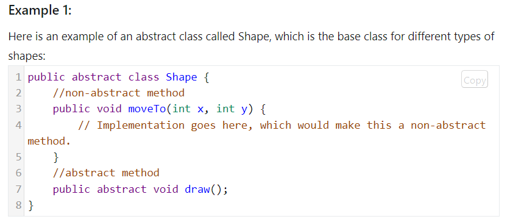
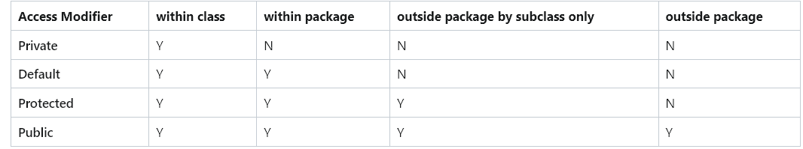

## FOUR OOP Concepts

### Encapsulation
Encapsulation is demonstrated by how Java's `Math` class handles its methods and constructors. The class makes extensive use of static methods, allowing them to be called at the class level without needing an instance of the class. This is particularly evident in how the `Math` class sets its default constructor to private, preventing instantiation.

### Inheritance
In Java, inheritance is a core concept where every class implicitly extends the `Object` class. This inheritance allows any class to use the methods defined in the `Object` class, showcasing a fundamental aspect of Java's Method overriding occurs when a subclass provides its own implementation of a method declared by one of its parent classes.

object-oriented programming model.

### Polymorphism
Polymorphism in Java allows a method or constructor to take multiple forms. It can be categorized into two types:
- **Overloading**: Where methods within the same class share the same name but have different parameters.
Compile-time polymorphism (also known as static polymorphism or method overloading) is achieved through method overloading.
- **Overriding**: Where a method in a subclass has the same name and method signature as a method in its superclass. 
The `@Override` annotation is used to ensure that a method is correctly overriding a method from its superclass.
-Method overriding occurs when a subclass provides its own implementation of a method declared by one of its parent classes.


### Abstraction
- Abstraction in Java can be achieved through interfaces and abstract classes. 
- the class is meant to be extended but cannot initialize objects

- **Interfaces**: An interface in Java is a reference type, similar to a class, that can contain only constants, method signatures, default methods, static methods, and nested types. Methods in interfaces are abstract by default.
- by default all variables in in interfaces are public static final constants.  
Run-time polymorphism (also known as dynamic polymorphism or method overriding) is achieved through method overriding. This is when a subclass provides a specific implementation for a method already defined in its superclass. The Java runtime determines which method to invoke based on the type of object on which the method is called at runtime.
  
```java
interface Income {
    double calculate(double salary, double taxes);
}

public class InterfaceExample {
    public static void main(String[] args) {
        // Implementation code here
    }

    class Employee implements Income {
        @Override
        public double calculate(double salary, double taxes) {
            return salary - taxes;
        }
    }
}

```



### Abstract Class
```
If I need to use methods with code use abstract classes. technically you can use default methods to accomplish this, but don't do this it's bad practice.
Methods in abstract classes are not public by default
```

---

## Wednesday Static Method
### Static Method
- We can use static methods when the static method does not depend on the attributes of the class
- static methods cannot access attributes of instances since they would not know which attribute to access directly
``` java
class ClassName {
  // static variable
  public static type variableName;

  // static method
  public static returnType methodName(parameters) {
      // implement the logic for your method here  
  }
}
// To call a static method or variable, use the Class Name
System.out.println(ClassName.staticVariable);
ClassName.staticMethod();
```
- Q static methods only have access to other static variables and static methods (unless the static method creates an object through which to access instance variables and methods). 
- to access methods from main MAKE THEM STATIC !!!!
- Static methods cannot access or change the values of instance variables, but they can access or change the values of static variables contained within their class.

### Access Modifier


