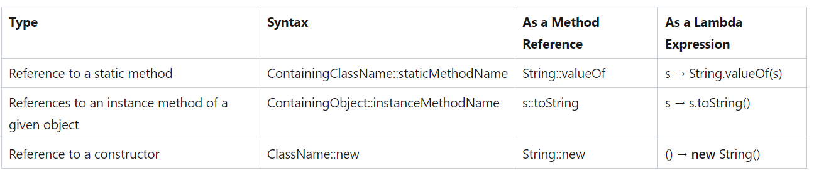

# Backend
- Degree, is the number o attributes
- Cardinality is uniqueness within a column ???
- Domain, the types of values that are allowed within a column/attribute
- Performance and Scalability: Databases offer optimization techniques to improve performance and handle increasing amounts of data. Indexing, caching, and query optimization are some of the features provided by databases to ensure fast and efficient data retrieval. Additionally, databases can be scaled horizontally or vertically to handle increased load or accommodate future growth.

- Callback function
