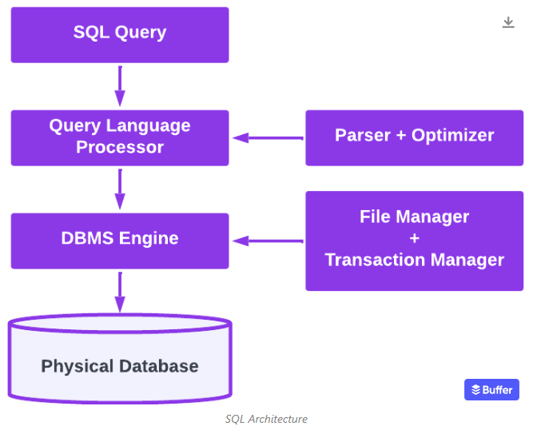

# Backend
- Degree, is the number o attributes
- Cardinality is uniqueness within a column ???
- Domain, the types of values that are allowed within a column/attribute
- Performance and Scalability: Databases offer optimization techniques to improve performance and handle increasing amounts of data. Indexing, caching, and query optimization are some of the features provided by databases to ensure fast and efficient data retrieval. Additionally, databases can be scaled horizontally or vertically to handle increased load or accommodate future growth.


- Callback funcOtion

## SQL

- there is DDL (CREATE, ALTER, DROP), DML (the one I know) and DCL (GRANT REVOKE) which is all about priveliges
- In real life we identify Entities. Know, what the hell is an entity ? subjective but I feel there is standardized way's to see enttities. This will automatically bring us to the 3NF

1NF
- cell's have single values (no data structures), unique records, primary keys, records are order indepenedent 
2NF
- denotes that there is a column specifically for Primary key
3NF (The standard)
- no transitive properities; If a column has a repeating value, this means that it depends on another column
- This means we have to create bridge tables to connect tables. This table is typcally always necessary when we have a bridge table
4NF -> no table can have contain two indepent data points describing an entity

- Each Entity is it's own table 

- Views are in memory ?? and Tables are in database ??
- we are using ER diagrams within the GUI

- In real life we create the ER diagrams first and then after have the tool generate the SQL for us

## FeedApp
### Functional requirements:
**Backend**
- Registering and authenticating users
- Posting and deleting feeds
- Liking and commenting on feeds
- Fetching feeds to display to users
**Frontend**
- User Registration and Login forms
- A feed display area to show all posts from users
- Components to create new feeds
- User Profile pages showing personal user information and their posts

### Non-functional requirements:
- Writing Unit Tests
- testing browser using selenium
- Cucumber 
- testing RESTful API's using RESTassured
- Using Allure for to streamline test report development
- Using Postgres for the database, 
- developing Backend API's using Spring boot
- Using React framework for the frontend

### Design
```
User
    userId integer (primary key)
    name VARCHAR(255)
    email VARCHAR(255) 
    password VARCHAR(255)
    timeCreated TIMESTAMP
Profile
    profileID INTEGER (primary key)
    userID (foreign key)
    bios TEXT
    location VARCHAR(255)
    profilePicture varchar(255)
    birthdate DATE,
Feed
    feedId INTEGER (primary key)
    userId (foreign key)
    userTextPosts VARCHAR
    userImagesURL VARCHAR
    userVideosURL VARCHAR
FeedMetaData
    FeedMetaDataId (primary key)
    feedId (foreign key)
    likeCount INTEGER
    comments VARCHAR
    shareCount INTEGER
Message
    messageId INTEGER (primary key)
    senderId INTEGER (foreign key)
    receiverId INTEGER (foreign key)
    textMessage TEXT
```