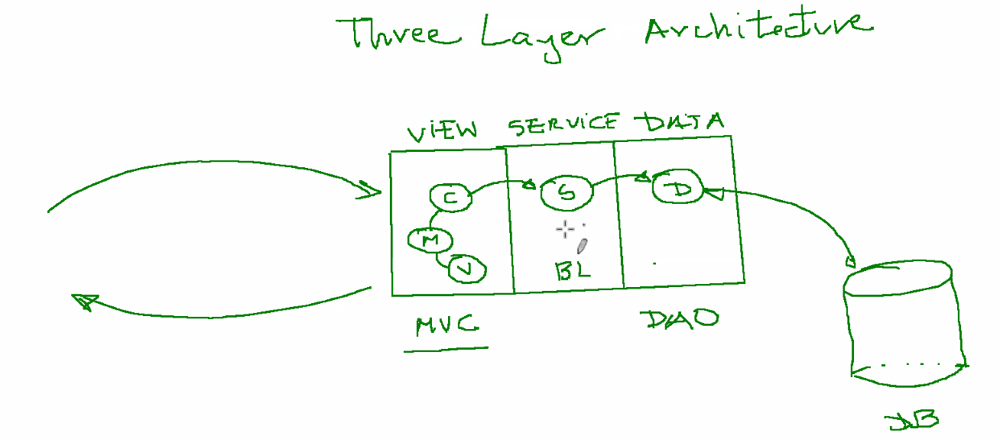
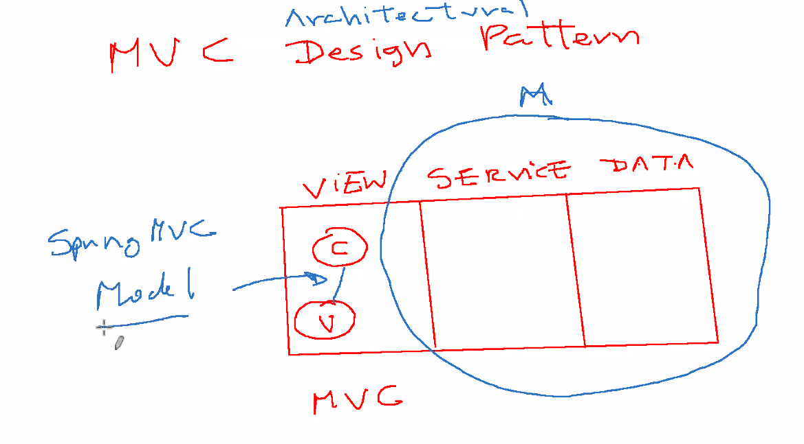

# Backend
- Degree, is the number o attributes
- Cardinality is uniqueness within a column ???
- Domain, the types of values that are allowed within a column/attribute
- Performance and Scalability: Databases offer optimization techniques to improve performance and handle increasing amounts of data. Indexing, caching, and query optimization are some of the features provided by databases to ensure fast and efficient data retrieval. Additionally, databases can be scaled horizontally or vertically to handle increased load or accommodate future growth.


- Callback funcOtion

## SQL

- there is DDL (CREATE, ALTER, DROP), DML (the one I know) and DCL (GRANT REVOKE) which is all about priveliges
- In real life we identify Entities. Know, what the hell is an entity ? subjective but I feel there is standardized way's to see enttities. This will automatically bring us to the 3NF

1NF
- cell's have single values (no data structures), unique records, primary keys, records are order indepenedent 
2NF
- denotes that there is a column specifically for Primary key
3NF (The standard)
- no transitive properities; If a column has a repeating value, this means that it depends on another column
- This means we have to create bridge tables to connect tables. This table is typcally always necessary when we have a bridge table
4NF -> no table can have contain two indepent data points describing an entity

- Each Entity is it's own table 

- Views are in memory ?? and Tables are in database ??
- we are using ER diagrams within the GUI

- In real life we create the ER diagrams first and then after have the tool generate the SQL for us

## FeedApp
### Functional requirements:
**Backend**
- Registering and authenticating users
- Posting and deleting feeds
- Liking and commenting on feeds
- Fetching feeds to display to users
**Frontend**
- User Registration and Login forms
- A feed display area to show all posts from users
- Components to create new feeds
- User Profile pages showing personal user information and their posts

### Non-functional requirements:
- Writing Unit Tests
- testing browser using selenium
- Cucumber 
- testing RESTful API's using RESTassured
- Using Allure for to streamline test report development
- Using Postgres for the database, 
- developing Backend API's using Spring boot
- Using React framework for the frontend

### Design
```
User
    userId integer (primary key)
    name VARCHAR(255)
    email VARCHAR(255) 
    password VARCHAR(255)
    timeCreated TIMESTAMP
Profile
    profileID INTEGER (primary key)
    userID (foreign key)
    bios TEXT
    location VARCHAR(255)
    profilePicture varchar(255)
    birthdate DATE,
Feed
    feedId INTEGER (primary key)
    userId (foreign key)
    userTextPosts VARCHAR
    userImagesURL VARCHAR
    userVideosURL VARCHAR
FeedMetaData
    FeedMetaDataId (primary key)
    feedId (foreign key)
    likeCount INTEGER
    comments VARCHAR
    shareCount INTEGER
Message
    messageId INTEGER (primary key)
    senderId INTEGER (foreign key)
    receiverId INTEGER (foreign key)
    textMessage TEXT
```

Operators


- Transactions ensure the code executes in an all or nothing fashion
- Intersect, Except 
- We use ORM as it saves us a ton of time. Currently Carlos showed us the verbose example without it that utlizes JPA and Hibernate.
- JDBC is 1- indexed

## Spring
### Frameworks

- Design Patterns Dependency Injection, Inversion Of Control
**Inversion of Control** 
- The IoC Container takes control of managing lifecycles of objects, which are referred to as beans. Developers define dependencies using annotations in configuration files and Spring container injects these dependencies at run time. Instead of application code calling the framework to get dependencies, the framework injets dependencies into the application code INVERTING this relationship.
- advantages are loose coupling as objects don't instantiate or manage their dependencies directly

**Dependency Injection**
- Dependent objects can be created outside the class and be provided to the class differently 
- when each object has a single job SRP, Spring Framework can pick and choose amongst them how to optimize and run the application
- Classes no longer create objects to instantiate their own objects, Spring decides what's needed and injects instances to those classes/methods
- Injector Class (non Dependent) Injects service class object into the client class

**Singleton**
- When a resource is shared by many other resources You can use the Singleton
- This is a class that can only have one instantiated object of the class at a time
- We create an instance if it doesn't exist using a constructor, if it's already created then we return a reference to that preexisting object

**Factory Method Pattern**


- promotes loose coupling and modularity

**Proxy**
It can keep an Image hidden until it's verified that it's needed


**Model View Controller**
- Model is an object/JAVA POJO that carries data for the application
- View is the visualization of what the Model contains
- Controller it hits the other two and controls the data flow into the model object and updates the view whenever data changes.


**Front Controller Design**
-Front Controller Single Handler for all requests coming to the application from web app or just locally on computer
- Dispatcher an object dispatches request to specific handlers that must complete the requests
- View objects for which requests are made


### Annotations
Stereotype Annotations are a special sub-genre of Spring Annotation used to automatically create Spring beans at the application context level. These special keywords can be called markers for any class that fulfills a role within your application. On top of telling Spring what to do with the specified element, these annotations are also designed to speed up your development process by greatly reducing the amount of Spring XML configuration you must write. This is because annotated components can be compiled correctly without needing nearly as much configuration.


- **@SpringBootApplication**j start app without setting up everything ourselves
@SpringBootApplication: This annotation is a combination of three annotations: @Configuration, @EnableAutoConfiguration, and @ComponentScan. It is typically placed on the main class of a Spring Boot application. @SpringBootApplication enables the automatic configuration of the Spring application context, classpath scanning for components, and the setup of default configurations. It acts as the entry point of the Spring Boot application.

- **@RESTControler** makes easy to create APIs
@RestController: The @RestController annotation is used to indicate that a specific class is a controller in a Spring MVC application that provides RESTful web services. It combines the functionality of two other annotations, @Controller  and @ResponseBody to help us handle mapping request data (as in an HTTP request), as well as the response that's returned. Essentially, using @RestController makes it easier to build RESTful APIs since it automatically handles a big chunk of our web needs.

- **@Autowired** connects different parts of app together
@Autowired: The @Autowired annotation is used to facilitate automatic dependency injection, meaning it allows Spring to automatically provide the necessary dependencies to a class when it is instantiated.

<p> 
@RequestMapping: The @RequestMapping annotation is used to map HTTP requests to specific controller methods in a Spring application. It defines the URL path and HTTP method(s) that the method should handle. For example, if a method is annotated with @RequestMapping("/hello") and receives a GET request to /hello, Spring will route the request to that method to handle the request and return a response.

@PostMapping, @GetMapping

@Repository: The @Repository annotation is used to indicate that a class is a Spring Data repository. Spring Data repositories are used to handle data access and provide a simple way to interact with the database. When you annotate a class with @Repository, Spring will automatically create a bean for that class and provide methods for querying and manipulating data in the underlying database.

@Service: The @Service annotation is used to define the annotated class as a service in Spring, indicating that it contains business logic. It allows the class to be automatically discovered and utilized in other parts of the application.

@PathVariable: The @PathVariable annotation is used in Spring to capture values from the URI (Uniform Resource Identifier) and use them as method parameters in a controller. It enables extraction of dynamic values from the URL and the passing of them to the controller method for further processing. (E.g., when you search for something and the URL says "https://www.site.ca/search?query=thing+you+searched+for"–those are passed values.)

<https://www.jrebel.com/blog/spring-annotations-cheat-sheet>

</p>
Creational
Structural
Behavioural


### MVC


- Java SE (standard edition for desktops) Java EE (enterprise for servers) Java ME (Micro edition for Mobile), Java Card
- JVM provides Java SE, Tomecat provides Java EE
- Apache Tomcat is a web container
- Java Beans are basic objects note they are different then Spring Beans that are created within the Spring IoC container

Three Layer Achitecture



#### DAO
- Is a Design Pattern LoLLL
<p>
The Data Access Object (DAO) is a structural pattern used to help us with the separation of concerns. Specifically, it isolates our business layer from the persistence (aka database) layer of our application through the use of an abstraction API. The DAO is how we build the data access layer of our application, and it supports all of our database connection needs.

The DAO maps application calls to the database and handles our CRUD requests without exposing the details of our database to parts of our application that do not need it. This isolation supports the single responsibility principle (atomicity), and keeps our logic separated into singular concerns. Through the DAO, we ensure that domain-specific objects and data types are only delivered to the places that require that information.
</p>

### JPA Java Persistence API


### Hibernate


### Mail


### JWT


### Security


### Testing
#### Mojito
We tell Mojito to mock an object and tell the Spring IoC to not inject it because we are mocking it instead

explain how these 6 files work together. What traits do they share? What does each pass along to the others? Why do we need all of them? 


### Json JPA Recursion

``` java
- @OneToOne
{
  "userId": 1,
  "profile": {
    "profileId": 1,
    "user": { "userId": 1, "profile": { ... } }
  }
}

- @OneToMany
{
  "userId": 1,
  "feeds": [
    {
      "feedId": 1,
      "user": {
        "userId": 1,
        "feeds": [
          { "feedId": 1, "user": { ... } },
          { "feedId": 2, "user": { ... } }
        ]
      }
    },

```

### Serialization
1) client sends post request when creating user
``` java 
{
  "username": "johndoe",
  "password": "password123",
  "firstName": "John",
  "lastName": "Doe"
}

2) Server Deserializes JSON data into User Java object
3) UserService saves object to database using UserRepository
4)Server Serilizes User object back into JSON for HTTP response
5) client receives JSON response
{
  "userId": 1,
  "username": "johndoe",
  "firstName": "John",
  "lastName": "Doe"
}

```

### Cors (cross origin )
- browser needs to check that both the frontend and backend have the same domain (www.bptn.com)
- Cors is when your frontend has a different domain then the backend
- We can tell the backend to 
- Cross-Origin Resource Sharing (CORS) is an HTTP-header based mechanism that allows a server to indicate any origins (domain, scheme, or port) other than its own from which a browser should permit loading resources

- CSRF is only helpful when we are using html not when we are using JSON like we are doing now

### Email Verification
``` java
+------------+           +-----------------+          +--------------------+          +------------------+
| User Signup|  --->    | Token Generation |  --->   | Send Verification  |  --->   |  Email Verification|
|            |           | (JWT)            |          | Email               |          |  Endpoint         |
+------------+           +-----------------+          +--------------------+          +------------------+
                                             |                                     |
                                             V                                     V
                                   +------------------+                    +--------------------+
                                   | JWT Token in URL |                    | Verify JWT Token   |
                                   +------------------+                    +--------------------+
                                                                                      |
                                                                                      V
                                                                        +-----------------------+
                                                                        | Update User Email     |
                                                                        | as Verified           |
                                                                        +-----------------------+
```
#### JsonInclude
- In a OneToOne relationship, the associated object (Profile in this case) might sometimes be null if the relationship is optional or has not been established yet. By using @JsonInclude(Include.NON_NULL), you avoid including a profile field with a null value in the JSON output, indicating more clearly that the profile is absent.

### TeachBack
``` Java
Super excited because today we get to dive into Spring and explore how four key component, come together to implement the magic ofLLLH Springs powerful features. 


JPA, as integrated in Spring, simplifies the development of the backend and database interactions by providing an abstraction layer over raw database access. This abstraction eliminates the need for boilerplate code associated with JDBC, such as manual connection management and SQL handling. JPA, along with Springs data access support, offers a more efficient and maintainable approach by leveraging ORM (Object-Relational Mapping), which allows developers to interact with the database using Java objects and standard JPA queries, rather than raw SQL. This streamlined approach not only reduces development time but also enhances code readability and maintainability.  ```