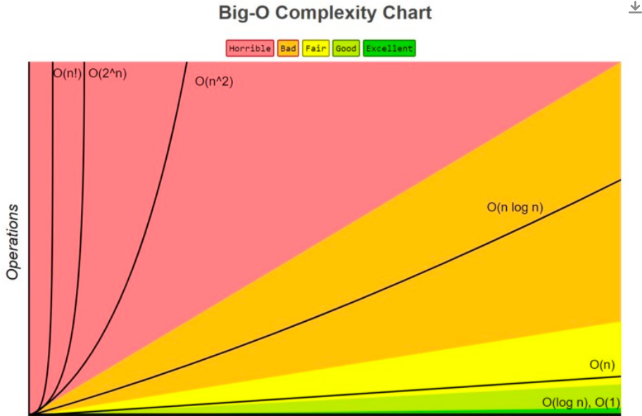
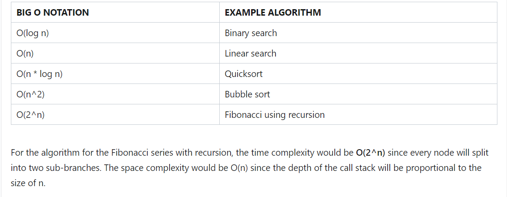
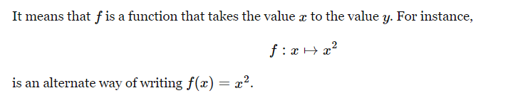

# Test Driven Development

@Test annotation over the method
- we use asserts to test
-  we should only test one behaviour at a time
- We should build the test before we build the method

TDD is important as it creates greater certainty around the behavior of our code. - TDD States that being able to create tests before we actually create the code ensures greater reliability of the code

This allows us greater confidence in refactoring our code as we can ensure that we haven't broken any core functionality

Not only can you test methods to make sure they return the expected result, you can also test exceptions to make sure that they are thrown when they are supposed to

 Writing TDD also helps the developer think more comprehensively about all the edge cases that the code needs to consider leading to more reliable code

Unit Tests help developers create automated testing which is a great tool as projects get larger as larger projects are harder to test. 

Method's with giant bodies are hard to test for but as code is broken down into classes and smaller chucks writing unit tests becomes easier 

TDD methodology includes

Write Tests → Watch if Fail → Code Behaviour that will pass the Test → Check the Test to see if it actually passes → Now you can refactor your code in the future, You never need to refactor the test and the code should always still pass the test if it doesn't there is an error in the code

@Test denotes a method is a test

JUnit 5 leverages features from Java 8 or later, such as lambda functions, making tests more powerful and easier to maintain.

JUnit 5 has added some very useful new features for describing, organizing, and executing tests. For instance, tests get better display names and can be organized hierarchically.
JUnit 5 is organized into multiple libraries, so only the features you need are imported into your project. With build systems such as Maven and Gradle, including the right libraries is easy.
JUnit 5 can use more than one extension at a time, which JUnit 4 could not (only one runner could be used at a time). This means you can easily combine the Spring extension with other extensions (such as your own custom extension).

#Algorithms


```
<https://stackoverflow.com/questions/487258/what-is-a-plain-english-explanation-of-big-o-notation>
relative: you can only compare apples to apples. You can't compare an algorithm that does arithmetic multiplication to an algorithm that sorts a list of integers. But a comparison of two algorithms to do arithmetic operations (one multiplication, one addition) will tell you something meaningful;
representation: BigOh (in its simplest form) reduces the comparison between algorithms to a single variable. That variable is chosen based on observations or assumptions. For example, sorting algorithms are typically compared based on comparison operations (comparing two nodes to determine their relative ordering). This assumes that comparison is expensive. But what if the comparison is cheap but swapping is expensive? It changes the comparison; and
complexity: if it takes me one second to sort 10,000 elements, how long will it take me to sort one million? Complexity in this instance is a relative measure to something else.
```
**Time Complexity** Tells us about efficienc of an algorithm when the size of the input becomes enormous
**Space Complexit** Tells us about the memory used by an algoritm when the size of the input becomes enormous


## Insertion Sort
``` java
Sort of complex to understand and recall. But I possibly could recreate
 two loops. We start right to left. Temp set up for the swap in the end. 
 while (possibleIndex > 0 && tempValue < elements[possibleIndex - 1]) {
    swap may take place after the while loop
```

### Swaps
Collections.swap(list, i, j);
public static void swap(int[] arr, int i, int j) {
    int temp = arr[i];
    arr[i] = arr[j];
    arr[j] = temp;
}

## Quicksort
Quicksort Code Explanation in 5 Lines:
```
Conceptually we pick a pivot p |  low[] < p > high[] 
Swap Method: Swaps elements to ensure smaller elements move to the left of the pivot.
Partition Method: Divides the array into sub-arrays where elements less than the pivot are on the left, and elements greater are on the right, then places the pivot in its correct position.
Sort Method: Recursively applies the partition method to sub-arrays until the entire array is sorted.
Recursive Sorting: Continues dividing and sorting sub-arrays, shrinking the problem size with each call.
Main Method: Initializes the array and triggers the sorting process.

// Usage:
swap(arr, i, j);
```

## Recursion
- focus on finding the base case. We then subsitute that case up the call stack. THIS IS RECURSION !!!

## Functional Programming
Lambdas bridge the gap between pure OOP and functional programming by allowing us to pass around methods as if they were regular variables. T
``` java
(parameters) -> {
    // Code to run, optionally using those parameters
};

// If you only have one statement to run, you can even omit the curly braces:
(parameters) -> codeForThingToReturn;

// And if you don't need any parameters, you just put the empty parentheses:
() -> codeForThingToReturn;

// Let's take in some numbers and actually do some work with this functional interface:
@FunctionalInterface
interface ActuallyComputeValue {
    double getValue2(int x, int y);    
}

// If we wanted to implement our getValue method the traditional way, it might look like this:
double getValue2(int x, int y) {
    return x * y;
}

// And as a lambda, we could rewrite it like so:
(x, y) -> x * y;
arrayName.forEach( (item) -> { System.out.println(item); } );

public class FibonacciRecursion {

    // Recursive method to calculate the nth Fibonacci number
    public static int calculateFibonacci(int n) {
        return n <= 1 ? n : calculateFibonacci(n - 1) + calculateFibonacci(n - 2);
    }

    public static void main(String[] args) {
        System.out.println("First 10 Fibonacci Numbers:");
        java.util.stream.IntStream.range(0, 10)
                                  .map(FibonacciRecursion::calculateFibonacci)
                                  .forEach(i -> System.out.println("Fibonacci(" + i + ") = " + calculateFibonacci(i)));
    }
}

Quicksort implementation
import java.util.Arrays;
import java.util.List;
import java.util.stream.Collectors;
import java.util.stream.Stream;

public class QuickSortFunctional {

    public static void main(String[] args) {
        Integer[] array = {10, 7, 8, 9, 1, 5};
        List<Integer> sortedList = quickSort(Arrays.asList(array));
        sortedList.forEach(i -> System.out.print(i + " "));
    }

    public static List<Integer> quickSort(List<Integer> list) {
        if (list.size() <= 1) {
            return list;  // Base case: a list with 0 or 1 element is already sorted
        }

        int pivot = list.get(list.size() / 2);  // Choose the middle element as the pivot

        // Partition the list into three sublists: less, equal, and greater
        List<Integer> less = list.stream()
                .filter(e -> e < pivot)
                .collect(Collectors.toList());

        List<Integer> equal = list.stream()
                .filter(e -> e == pivot)
                .collect(Collectors.toList());

        List<Integer> greater = list.stream()
                .filter(e -> e > pivot)
                .collect(Collectors.toList());

        // Recursively sort the less and greater sublists, then concatenate the results
        return Stream.concat(
                Stream.concat(
                        quickSort(less).stream(),
                        equal.stream()
                ),
                quickSort(greater).stream()
        ).collect(Collectors.toList());  // Convert back to List<Integer>
    }
}

```
